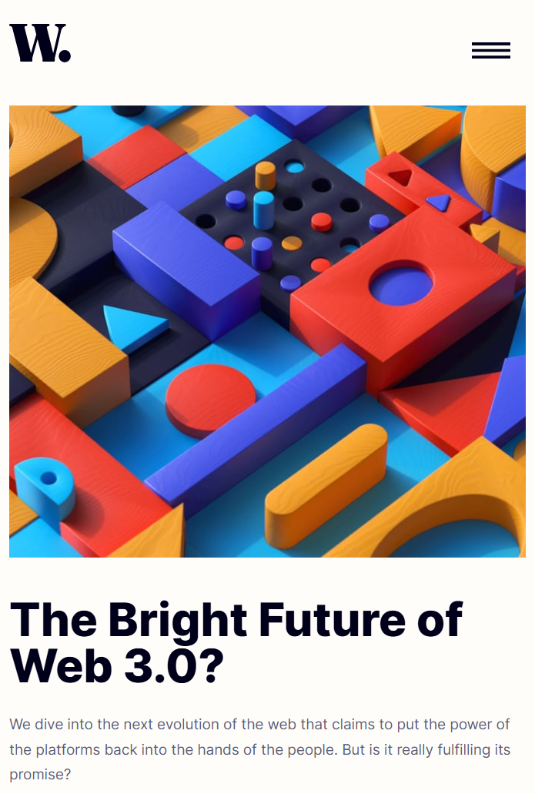

# Frontend Mentor - News homepage solution

This is a solution to the [News homepage challenge on Frontend Mentor](https://www.frontendmentor.io/challenges/news-homepage-H6SWTa1MFl). Frontend Mentor challenges help you improve your coding skills by building realistic projects. 

## Table of contents

- [Overview](#overview)
  - [The challenge](#the-challenge)
  - [Screenshot](#screenshot)
  - [Links](#links)
- [My process](#my-process)
  - [Built with](#built-with)
  - [What I learned](#what-i-learned)
  - [Useful resources](#useful-resources)
- [Author](#author)

## Overview

### The challenge

Users should be able to:

- View the optimal layout for the interface depending on their device's screen size
- See hover and focus states for all interactive elements on the page

### Screenshot



### Links

- Solution URL: https://github.com/MaxPlummer/news-homepage
- Live Site URL: https://maxplummer.github.io/news-homepage/

## My process

### Built with

- Semantic HTML5 markup
- CSS custom properties
- W3.CSS Framework
- JavaScript
- Mobile-first workflow

### What I learned

I learned how to implement a CSS framework into my page. I have never used a proper framework to make styling easier, so this was a valuable new experience for me. It is a bit messy in this project, but I hope to learn more and sharpen my skills with other frameworks. 

```html
<main class="w3-container">
  <div class="w3-row">
    <div class="w3-twothird pad-right">
```
I also learned how to use the onresize method in JavaScript for my project. In this case, I used it to trigger a function that closes the mobile menu when the screen enlarges beyong 799 pixels, which is when the navbar at the top of the page appears as per a media query.
```js
window.onresize = () => {
  if (window.innerWidth >= 799) {
    w3_close();
  }
};
```

### Useful resources

- [W3.CSS Tutorial](https://www.w3schools.com/w3css/default.asp) - This is the tutorial for the W3.CSS framework from W3Schools. I learned all about how to use the framework for my project through this tutorial. I plan to test out other frameworks in future projects, but this tutorial was a helpful intro for me. 

## Author

- GitHub - [MaxPlummer](https://github.com/MaxPlummer)
- Frontend Mentor - [@MaxPlummer](https://www.frontendmentor.io/profile/MaxPlummer)
- LinkedIn - [Maxwell Plummer](https://www.linkedin.com/in/maxwell-plummer-1b2b13291/)
